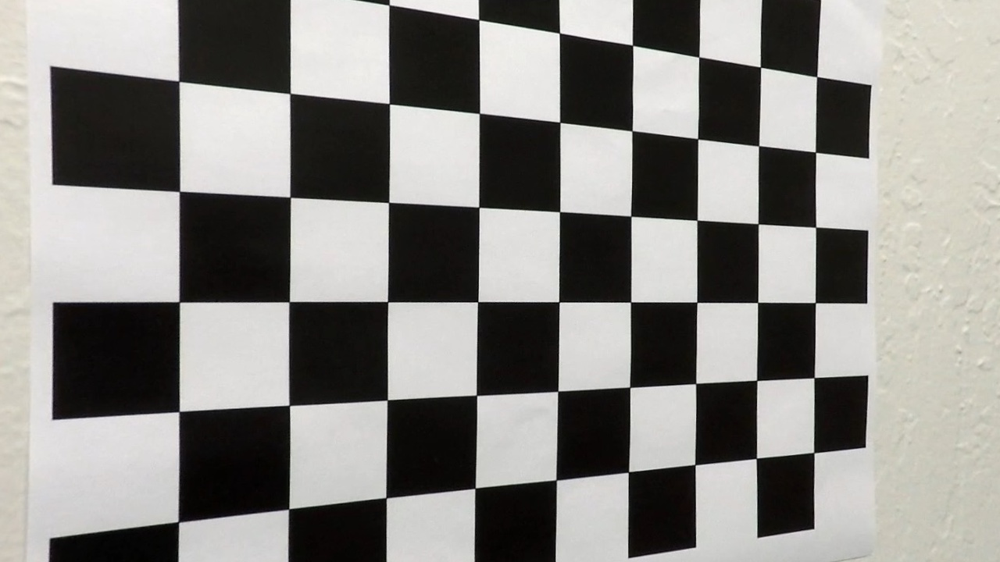
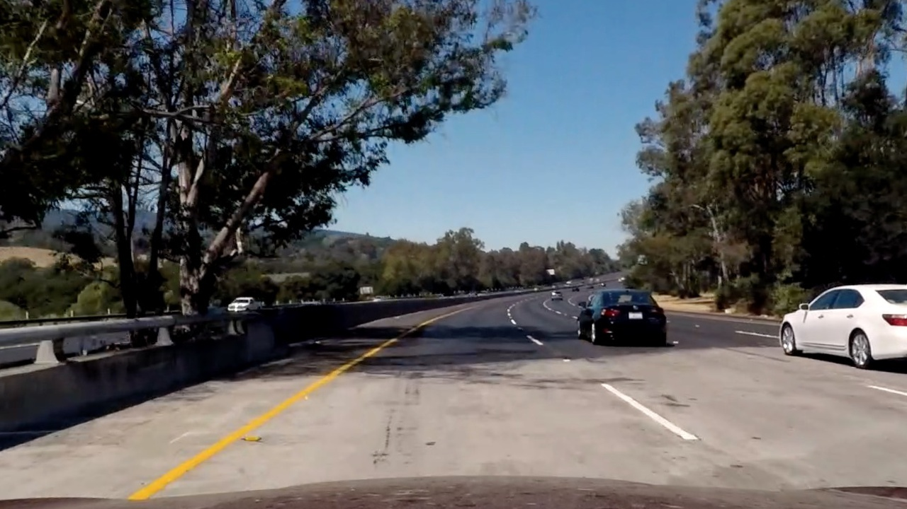
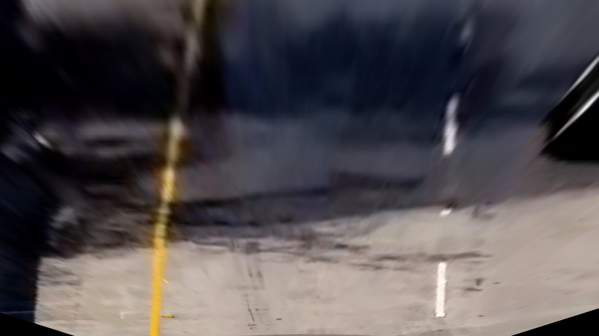
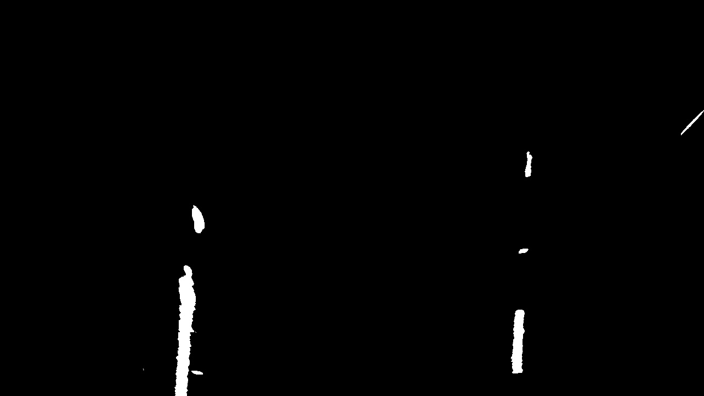
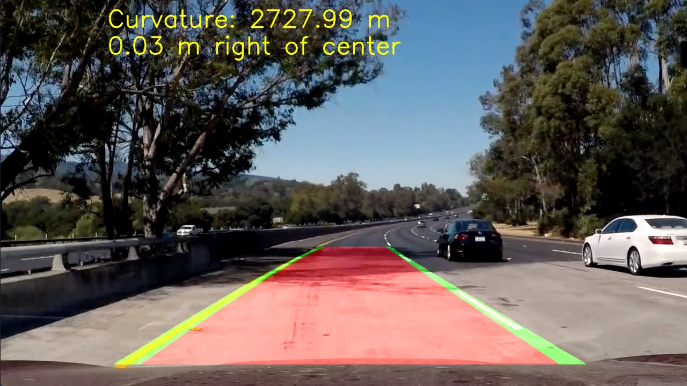

# CarND-Advanced-Lane-Finding-P4

The goals / steps of this project are the following:

* Compute the camera calibration matrix and distortion coefficients given a set of chessboard images.
* Apply a distortion correction to raw images.
* Apply a perspective transform to get "birds-eye view" on the road
* Use YUV transform to get treshold binary image
* Detect lane pixels and fit to find the lane boundary.
* Determine the curvature of the lane and vehicle position with respect to center.
* Warp the detected lane boundaries back onto the original image.
* Output visual display of the lane boundaries and numerical estimation of lane curvature and vehicle position.

#### Repository 

Below I will provide brief description of files in this repository:
*lane-lines.py - main file used to load videos and save them after processing
*pipeline.py - contains functions used for image processing and enhancing
*calibration.py - constains functions used to calculated camera coefficients from calibration images
*lane.py - contains Line class used to store information about a line
*camera.py - contains Camera class that stores info about camera coeffs, etc.
* .mp4 videos used as input
* output_images containing videos enhanced in code

#### Pipeline visualization:

1. Camera calibration - uses code in calibration.py. Calibration images depict 9x6 chessboard to calculate and return camera coefficients.

 Original calibration image
 Calibration image after undistorting

2. Apply a distortion correction to the original image

 Original image
 Image after undistorting

3. Apply a perspective transform to get "birds-eye view" on the road.
Following source and destination points were used to accomplish this:

| Source        | Destination   | 
|:-------------:|:-------------:| 
| 575, 460      | 350, 0        | 
| 710, 460      | 930, 0        |
| 260, 680      | 350, 720      |
| 1060, 680     | 930, 720      |

 Birds-eye view on the road in front of the car

4.Use YUV transform to get treshold binary image

 Binary treshold image

5. Use binary treshold image to calculate lane pixels to fit lane boundry, then determine curvature of the land and calculate vehicle offset with respect to the center.

6. Warp the detected lane boundaries back onto the original image.

7. Mark lanes and road between them on top of original image.

8. Write info about lane curvature and offset from center on image

 Final output image

#### Problems

One problem I noticed with my implementation is that smoothing over few iterations makes lane finding less responsive to dynamically changing lanes. I can be seen on harder_challenge_video_output.mp4 around 0:40 when car gets a little wobbly and detected lanes are a bit above/under where they are in reality. One approach to solve this problem might be to reduce number of iterations used to calculated best fit for current frame. 
My approach might also struggle in poor light conditions or in pood weather conditions like snow or rain. I think then we would have to use some different sensors to help us stay in the lane.
